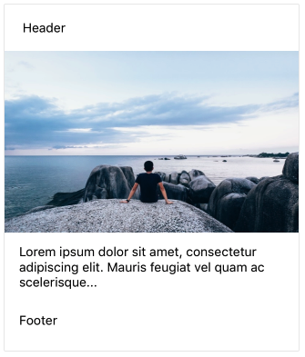

<div class="component" image="../../images/gif/card.gif"></div>

`RkCard` component used to render card view in your application. 
It's usually being used with its props (described below) applied to standard react or custom components. 


```html
import {RkCard} from 'react-native-ui-kitten';

//... 

<RkCard>
  <View rkCardHeader>
    <Text> Header </Text>
  </View>
  
  <Image rkCardImg source={require('../img/sea.jpg')}/>
  
  <View rkCardContent>
    <Text>
      Lorem ipsum dolor sit amet, consectetur adipiscing elit.
      Mauris feugiat vel quam ac scelerisque...
    </Text>
  </View>
  
  <View rkCardFooter>
    <Text>Footer</Text>
  </View>
</RkCard>
```

Here is output of code above:




By default there are 6 *rkCard* props: 

- `rkCardContainer` : Used for styling root card container.
- `rkCardHeader` : Used for styling header of card. 
- `rkCardImg` : Used for styling image content in card.
- `rkCardImgOverlay` : Used for styling component which will be displayed over the image.
- `rkCardContent` : Used for styling content. (usually text)
- `rkCardFooter` : Used for styling footer of card.

Every component inside `RkCard` can use these props to define specific layout styles to that component. 


### Create custom rkType

You can define new `rkType` and then reuse it. You can change style of each of *rkCard* props:

```javascript
import {RkCard, RkTheme} from 'react-native-ui-kitten';

RkTheme.setType('RkCard', 'story', {
  img: {
    height: 100,
    opacity: 0.7
  },
  header: {
    alignSelf: 'center'
  },
  content:{
    alignSelf:'center'
  }
});

//...

 <RkCard rkType='story'>
  <Image rkCardImg source={require('../img/sea.jpg')}/>

  <View rkCardHeader>
    <RkText rkType='header'>Once upon a time</RkText>
  </View>

  <View rkCardContent>
    <RkText style={{textAlign:'center'}}>
      One morning, when Gregor Samsa woke from happy dreams, he found himself transformed in ...
    </RkText>
  </View>

  <View rkCardFooter>
    <RkButton rkType='small outline'>Learn More</RkButton>
    <RkButton rkType='small'>Read later</RkButton>
  </View>
</RkCard>

```

Here is result:


Each *rkProp* mapped to key. This key can be used for styling. 

- `container` : Style key for `rkCardContainer`.
- `header` : Style key for `rkCardHeader`.
- `content` : Style key for `rkCardContent`.
- `footer` : Style key for `rkCardFooter`.
- `img` : Style key for `rkCardImg`.
- `imgOverlay` : Style key for `rkCardImgOverlay`.


### Props

<div class="doc-prop">
    <p><strong><a href="../customization#rkType">rkType</a></strong> string</p>
    <p>By default RkCard supports following types: shadowed, heroImage</p>
</div>

<div class="doc-prop">
    <p><a href="https://facebook.github.io/react-native/docs/view.html#props" target="_blank">View.props</a></p>
    <p>Style for root container of <strong>RkCard</strong></p>
</div>
