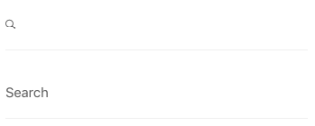
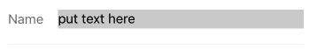

<div class="component" image="../../images/gif/input.gif"></div>


`RkTextInput` is a component to be used as a basic text input.

Usage example:

```html
import {RkTextInput} from 'react-native-ui-kitten';

//... 

<RkTextInput placeholder='Login'/>

```


### Usage with icon or label

`RkTextInput` can contain label or icon. By clicking on label/icon input will be focused.

```javascript
import Icon from 'react-native-vector-icons/Ionicons';
import {RkTextInput} from 'react-native-ui-kitten';

//...

<RkTextInput label={<Icon name={'ios-search'}/>}/>

<RkTextInput label='Search'/>

``` 

Here is the result:



<a href="#" id="custom"></a>

### Create custom rkType

To define new `rkType` you can use predefined properties which will passed to according element inside component:

```javascript

import {RkTheme} from 'react-native-ui-kitten';

RkTheme.setType('RkTextInput','success',{
  labelColor:'darkgreen',
  underlineColor:'darkgreen',
  underlineWidth:1,
});

```

Now you can use *success* type in your app:

```javascript
import {RkTextInput} from 'react-native-ui-kitten';

//...

<RkTextInput label='Login' rkType='success'/>

```
Code above should render this:


#### Available properties:

- `color` : Color of typed text inside `RkTextInput`.
- `inputBackgroundColor` : Background color of `TextInput` inside `RkTextInput`
- `placeholderTextColor` : Color of placeholder text.
- `labelColor` : Color of label/icon.
- `labelFontSize` : Font size of label
- `backgroundColor` : Background color of `RkTextInput`.
- `borderWidth` : Width of outer border.
- `borderRadius` : Border radius of `RkTextInput`.
- `borderColor` : Color of border.
- `underlineWidth` : Width of bottom border of component.
- `underlineColor` : Color of bottom border of component.
- `width` : Width of `RkTextInput`.
- `height` : Height of `RkTextInput`.

### Advanced Styling

It's also possible to implement more detailed styling. `RkTextInput` consists from couple of base react components.
You can easily set styles for each component.

For example you can change the opacity of content passed to RkButton:

```javascript

import {RkTextInput, RkTheme} from 'react-native-ui-kitten';

RkTheme.setType('RkTextInput', 'frame', {
  input: {
    backgroundColor: 'white',
    marginLeft: 0,
    marginHorizontal: 0,
    borderRadius: 5
  },
  color: 'gray',
  backgroundColor: 'gray',
  borderRadius: 10,
  container: {
    paddingHorizontal: 20
  }
});

//...

<RkTextInput rkType='frame'/>

```

Here is result of code above:


#### Available components

- `container` : `TouchableOpacity` - container of `RkTextInput`.
- `input` : `TextInput`.
- `label` : `Text` or other View tree that you had specified in `label` props.


### Inline styling

It's possible to set styles inline. Use props `style` for `container` component,
 `labelStyle` for `label` component and `inputStyle` for `input`.

Here is example of inline style usage:
```html
import {RkTextInput} from 'react-native-ui-kitten';

//...

<RkTextInput
  labelStyle={{color: 'gray'}}
  label={'Name'}
  inputStyle={{
    backgroundColor: 'lightgray',
    color: 'black',
  }}/>
```

Code above should produce this:



### Props

<div class="doc-prop">
    <p><strong><a href="../customization#rkType">rkType</a></strong> string</p>
    <p>By default RkTextInput supports following types: bordered, rounded, form, topLabel</p>
</div>

<div class="doc-prop">
    <p><a href="https://facebook.github.io/react-native/docs/textinput.html#props" target="_blank">TextInput.props</a></p>
</div>

<div class="doc-prop">
    <p><strong>style</strong> TouchableOpacity.style</p>
    <p>Style for TouchableOpacity wrapping input and label</p>
</div>

<div class="doc-prop">
    <p><strong>label</strong> string || component</p>
    <p>Label displayed with input. When label is clicked input gets focus</p>
</div>

<div class="doc-prop">
    <p><strong>labelStyle</strong> style</p>
    <p>Style applied to label</p>
</div>

<div class="doc-prop">
    <p><strong>inputStyle</strong> TextInput.style</p>
    <p>Style applied to text input</p>
</div>