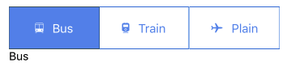
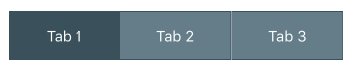
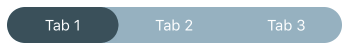

<div class="component" image="../../images/gif/tab.gif"></div>


`RkTabView` is a component to display tabs in your application.

Usage example:

```html
import {RkTabView} from 'react-native-ui-kitten';

//...

<RkTabView>
  <RkTabView.Tab title={'Tab 1'}>
    <Text>Tab 1 Content</Text>
  </RkTabView.Tab>
  <RkTabView.Tab title={'Tab 2'}>
    <Text>Tab 2 Content</Text>
  </RkTabView.Tab>
  <RkTabView.Tab title={'Tab 3'}>
    <Text>Tab 3 Content</Text>
  </RkTabView.Tab>
</RkTabView>
```


### Custom tab titles

Often you need to put into header not only text but more complex view tree. In this case you can pass into `title` prop
a function which will render header. Function can accept `isSelected` parameter in order to render selected or regular 
tab header.

Here is an example:

```javascript
import {RkTabView} from 'react-native-ui-kitten';

//...

let renderTab = (isSelected, title, icon) => {
  let backgroundColor = isSelected ? 'cornflowerblue' : 'white';
  let color = (!isSelected) ? 'cornflowerblue' : 'white';
  return (
    <View
      style={{
        backgroundColor,
        justifyContent: 'center',
        flexDirection: 'row',
        alignItems: 'center',
        padding: 17,
      }}>
      <Icon name={icon} style={{color, fontSize: 16}}/>
      <RkText style={{color, marginLeft: 11}}>{title}</RkText>
    </View>);
};

//...

<RkTabView>
  <RkTabView.Tab title={(selected) => {
    return renderTab(selected, 'Bus', 'ios-bus');
  }}>
    <Text>Bus</Text>
  </RkTabView.Tab>
  
  <RkTabView.Tab title={(selected) => {
    return renderTab(selected, 'Train', 'ios-train');
  }}>
    <Text>Train</Text>
  </RkTabView.Tab>
  
  <RkTabView.Tab title={(selected) => {
    return renderTab(selected, 'Plain', 'ios-plane');
  }}>
    <Text>Plain</Text>
  </RkTabView.Tab>
</RkTabView>
```




### Create custom rkType

`RkTabView` is a component which style depends or it's internal state. There are 2 states for this component:
- unselected (base)
- selected

Each of this state can be configured using `rkTypes`. That means you can define set of correctly named `RkType`s 
and `RkTabView` will apply them according to its state.

Use the following convention:

- `%name%` : Unselected state.
- `%name%Selected` : Selected state.

\* Where `%name%` is name of yours `rkType`.

One more note: during state change `RkTabView` not *replace* base `rkType` with new one. It just *add* correct.
So *selected* component will have actually two `rkType`s - base and selected.

To define new `rkType` you can use predefined properties which will passed to according element inside component:

```javascript

RkTheme.setType('RkTabView', 'dark', {
  backgroundColor:'#778f9b',
  color:'white',
  borderColor:'#4a636d'
});

RkTheme.setType('RkTabView', 'darkSelected', {
  backgroundColor:'#4a636d',
  borderColor:'#4a636d'
});

//...

<RkTabView rkType='dark'>
  <RkTabView.Tab title={'Tab 1'}/>
  <RkTabView.Tab title={'Tab 2'}/>
  <RkTabView.Tab title={'Tab 3'}/>
</RkTabView>

```




#### Available properties:

- `color` : Color of content in header of `RkTabView`. Applied for `content` property.
- `backgroundColor` : Background color of tab in header.
- `borderWidth` : Width of tab border.
- `borderColor` : Color of tab border.


### Advanced Styling

It's also possible to implement more detailed styling. `RkTabView` consist from couple of base react components.
You can easily set styles for each component.

```javascript
RkTheme.setType('RkTabView', 'rounded', {
  backgroundColor: 'transparent',
  color: 'white',
  borderColor: '#4a636d',
  tabContainer: {
    padding: 2,
    borderRadius: 30,
    overflow: 'hidden',
    borderWidth: 0,
    borderLeftWidth: 0,
    borderRightWidth: 0,
  },
  content: {
    padding: 7
  },
  container: {
    backgroundColor: '#a6bfcc',
    borderRadius: 20
  }
});

RkTheme.setType('RkTabView', 'roundedSelected', {
  backgroundColor: '#4a636d',
  borderColor: '#4a636d'
});

//...

<RkTabView rkType='rounded'>
  <RkTabView.Tab title={'Tab 1'}/>
  <RkTabView.Tab title={'Tab 2'}/>
  <RkTabView.Tab title={'Tab 3'}/>
</RkTabView>

```



#### Available components

- `container` : `View` - root container of `RkTabView`.
- `headerContainer` : `View` - container for tab headers.
- `tabContainer` : `TouchableOpacity` - wraps each tab's header content.
- `content` : `RkText` when `label` prop used as string.


#### Inline styling

It's possible to set styles inline. Use props of `style` of `RkTabView` for `container` component and
 `headerContainerStyle` for `headerContainer` component.
 Use props `style` (unselected) and `styleSelected` (selected) of `RkTabView.Tab` for `tabContainer` component.
 Use props `contentStyle` (unselected) and `contentStyleSelected` (selected) of `RkTabView.Tab` for `contentStyleSelected` component.


Here is an example of inline styling:

```javascript
import {RkTabView} from 'react-native-ui-kitten';

<RkTabView style={{
  padding: 10,
  backgroundColor: 'lightgray', borderRadius: 5
}}>
  <RkTabView.Tab style={{backgroundColor: 'yellow'}}
                 styleSelected={{backgroundColor: 'cyan'}}
                 title={'Tab 1'}/>
  <RkTabView.Tab title={'Tab 2'}/>
  <RkTabView.Tab title={'Tab 3'}/>
</RkTabView>
```


### RkTabView Props

<div class="doc-prop">
    <p><strong><a href="../customization#rkType">rkType</a></strong> string</p>
    <p>By default RkTabView supports following types: material</p>
</div>
<div class="doc-prop">
    <p><strong>style</strong> View.style </p>
    <p>Style applied to RkTabView container (tabs & content)</p>
</div>
<div class="doc-prop">
    <p><strong>headerContainerStyle</strong> View.style </p>
    <p>Style applied to container wrapping tabs (not for the content)</p>
</div>
<div class="doc-prop">
    <p><strong>maxVisibleTabs</strong> number </p>
    <p>If defined, tabs will be scrollable and tab width will be screen.width/maxVisibleTabs</p>
</div>

### RkTabView.Tab Props

<div class="doc-prop">
    <p><strong>title</strong> string || function </p>
    <p>When type of title is string, title is rendered like Text inside of View.</p>
    <p>Otherwise title is rendered using function passed to this prop, function can apply isSelected argument and
     should return React component</p>
</div>
<div class="doc-prop">
    <p><strong>style</strong> View.style </p>
    <p>Style applied to RkTabView.Tab content container (used only when label is text)</p>
</div>
<div class="doc-prop">
    <p><strong>styleSelected</strong> View.style </p>
    <p>Style applied to RkTabView.Tab label container when tab is selected (used only when label is text)</p>
</div>
<div class="doc-prop">
    <p><strong>innerStyle</strong> Text.style </p>
    <p>Style applied to RkTabView.Tab label (used only when label is text)</p>
</div>
<div class="doc-prop">
    <p><strong>innerStyleSelected</strong> Text.style </p>
    <p>Style applied to RkTabView.Tab label when tab is selected (used only when label is text)</p>
</div>
